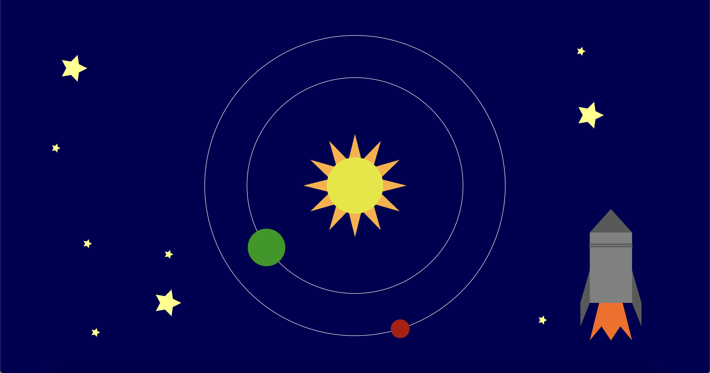
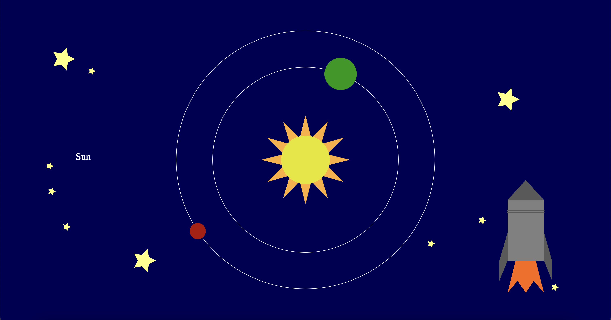

# Assignment 1 - Paola Frunzio

**Live Demo (GitHub Pages):**  
https://pfrunzio.github.io/a1-ghd3/index.html

## Description
I created a visual of our solar system using D3.js. It shows Earth and Mars animated to be orbiting around the sun, with stars and a rocket ship. My goal was to learn to set up and use D3 to create some graphics primitives. It is built with SVG elements and has some animated elements to add some complexity to the project. 

## Graphics Primitives Used
This project includes all required graphical primitives and various different colors to form a complete scene:
- **Rectangles:** body of the rocket
- **Circles:** sun, earth, mars
- **Lines:** detailing on the rocket
- **Paths:** used in the generation of the star shapes
- **Polygons:** rocket components, rocket fire
- **Different colors:** a variety of colors are used

## Interaction and Animation
- Implemented an animation to orbit the planets around the sun.
- Implemented an interaction where when the mouse hovers over the planets or sun a label appears on the left with its name. 
- The small stars in the background are generated so that they don't obstruct the solar system in the center of the scene. 
- The small stars generate in different spots every time the webpage is loaded, making it interactive and a unique scene each time. 
- The stars and rocket add to the space theme set by the solar system scene.

## Screenshots

This is the visual. 

This shows the visual when the mouse is hovering over the Sun and the label is visible.

## Sources
- D3.js library: https://d3js.org/
- Math for the star shape generation: https://observablehq.com/@anbnyc/drawing-stars
- All code was written by me. No external D3 templates were used.

## Technical Achievements
- The orbits of the earth and mars use d3-transition in a custom function to change their x and y positions and create the animation where they repeatedly circle the sun. 
- Used mouseover functions to make labels appear on the left side of the solar system when a mouse hovers over the sun or one of the planets. 
- Used SVG polygon geometry to create complex shapes for the rocket ship.
- Used SVG paths to generate star shapes that takes in the number of points on the star and computes where they would fall on a circle so that the points can be connected together to form a star shape. This is used as the stars in the background and the rays on the sun. The math for the shape generation was found here (https://observablehq.com/@anbnyc/drawing-stars), but the implementation is mine. 
- Organized the small star generation to not draw over the middle of the visual so they don't obstruct the solar system. 

## Design Achievements
- Selected hex code colors to represent the earth, mars, sun, stars, and rocket in their signature colors.
- Used shades of grey in the rocket to create depth and visual intrigue. 
- Used repetion and variation of size in the stars to create a more interesting backdrop for the solar system and rocket. 
- Set the background of the webpage to the same color as the rest of the solar system to create a cohesive visual with the SVG and the elements in it. 
- The earth is moving around the sun twice as fast as mars is, which is roughly accurate to the orbit cycle lengths in our real solar system.